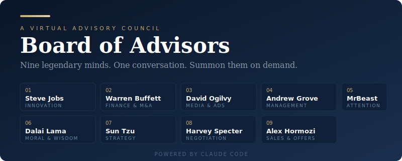

<p align="center">
  
</p>

<h1 align="center">Board of Advisors</h1>

<p align="center">
  <strong>Nine legendary minds. One conversation. Summon them on demand.</strong>
</p>

<p align="center">
  A virtual advisory council powered by <a href="https://claude.ai/code">Claude Code</a>.<br/>
  Ask a strategic question — get nine perspectives — receive a synthesized recommendation.
</p>

<p align="center">
  <a href="#quick-start">Quick Start</a> &bull;
  <a href="#the-board">The Board</a> &bull;
  <a href="#commands">Commands</a> &bull;
  <a href="#how-it-works">How It Works</a> &bull;
  <a href="#data-sources">Data Sources</a>
</p>

---

## The Concept

Every founder needs advisors. Not everyone can afford them. This repo gives you a virtual board of directors — nine iconic thinkers, each modeled as a Claude Code subagent with their own decision-making frameworks, voice, and domain expertise.

Ask a strategic question. Each advisor analyzes it through their unique lens. A synthesizer collects all perspectives and produces a structured output:

> **INSIGHTS** | **RISKS** | **OPTIONS** | **RECOMMENDATION** | **DISSENT**

The dissent matters most. The value isn't consensus — it's the tension between perspectives.

---

## The Board

<table>
<tr>
<td align="center" width="200">
<br/>
<strong>Steve Jobs</strong><br/>
<sub>Innovation & Product</sub><br/>
<sub><em>"Stay hungry, stay foolish."</em></sub>
</td>
<td align="center" width="200">
<br/>
<strong>Warren Buffett</strong><br/>
<sub>Finance & M&A</sub><br/>
<sub><em>"Price is what you pay.<br/>Value is what you get."</em></sub>
</td>
<td align="center" width="200">
<br/>
<strong>David Ogilvy</strong><br/>
<sub>Media & Advertising</sub><br/>
<sub><em>"The consumer is not a moron.<br/>She's your wife."</em></sub>
</td>
</tr>
<tr>
<td align="center">
<br/>
<strong>Andrew Grove</strong><br/>
<sub>Management & Org</sub><br/>
<sub><em>"Only the paranoid survive."</em></sub>
</td>
<td align="center">
<br/>
<strong>MrBeast</strong><br/>
<sub>Creativity & Attention</sub><br/>
<sub><em>"The first 5 seconds<br/>decide everything."</em></sub>
</td>
<td align="center">
<br/>
<strong>Dalai Lama</strong><br/>
<sub>Moral & Wisdom</sub><br/>
<sub><em>"Be kind whenever possible.<br/>It is always possible."</em></sub>
</td>
</tr>
<tr>
<td align="center">
<br/>
<strong>Sun Tzu</strong><br/>
<sub>Strategy & Special Sit.</sub><br/>
<sub><em>"Win first,<br/>then go to war."</em></sub>
</td>
<td align="center">
<br/>
<strong>Harvey Specter</strong><br/>
<sub>Negotiation & Deals</sub><br/>
<sub><em>"I don't have dreams.<br/>I have goals."</em></sub>
</td>
<td align="center">
<br/>
<strong>Alex Hormozi</strong><br/>
<sub>Sales & Offer Design</sub><br/>
<sub><em>"Make them an offer so good<br/>they feel stupid saying no."</em></sub>
</td>
</tr>
</table>

### What Each Advisor Brings

| Advisor | Domain | Key Frameworks | When to Consult |
|:--------|:-------|:---------------|:----------------|
| **Steve Jobs** | Innovation & Product | Simplify, Category Creation, Full Stack Control, Taste Test | Product direction, differentiation, simplification |
| **Warren Buffett** | Finance & M&A | Moat Analysis, Margin of Safety, Circle of Competence, Inversion | Pricing, capital allocation, M&A, financial risk |
| **David Ogilvy** | Media & Advertising | Headline Test, Big Idea, Positioning Clarity, The Promise | Marketing, messaging, brand, content strategy |
| **Andrew Grove** | Management & Org | Strategic Inflection Points, OKRs, High-Output Management | Hiring, org design, scaling, process |
| **MrBeast** | Creativity & Attention | Hook Optimization, Retention Curves, $1 vs $1M, A/B Everything | Content, distribution, viral strategy, growth |
| **Dalai Lama** | Moral & Wisdom | Interdependence Test, Compassion Audit, Long-term View | Ethics, stakeholder impact, purpose, culture |
| **Sun Tzu** | Strategy | Terrain Analysis, Indirect Approach, Five Factors, Economy of Force | Competitive strategy, market entry, positioning |
| **Harvey Specter** | Negotiation | Leverage Map, BATNA, First Offer, The Close, Bluff Detection | Deals, partnerships, contracts, tough conversations |
| **Alex Hormozi** | Sales & Offers | Value Equation, Grand Slam Offer, LTV:CAC, Sales Scripts | Pricing, offer design, lead gen, sales process |

---

## Quick Start

```bash
# 1. Clone the repo
git clone https://github.com/YOUR_USER/board_of_advisors.git
cd board_of_advisors

# 2. Copy the permissions template
cp .claude/settings.local.json.example .claude/settings.local.json

# 3. Open in Claude Code
claude

# 4. Run the setup wizard
/setup
```

The `/setup` command walks you through:
- Connecting your Obsidian vault (where your config and sessions will be stored)
- Auto-detecting connected data sources (Gmail, Calendar, Drive, Notion)
- Filling in your business context (stage, team, priorities, key numbers)
- Choosing which advisors to activate

> **Your data stays in your vault.** Board config, business context, and session records are saved to a `board/` folder inside your Obsidian vault — never in this repo. This means you can clone/fork this repo without worrying about leaking private data.

---

## Commands

### `/convene-board` — Full Board Session

Ask all 9 advisors a strategic question. They respond in parallel, then a synthesizer produces a structured recommendation.

```
/convene-board Should we raise a Series A or bootstrap?
```

**Output:** INSIGHTS | RISKS | OPTIONS | RECOMMENDATION | DISSENT

### `/ask` — Single Advisor

Route a question to one specific advisor.

```
/ask hormozi How should we price our product?
/ask buffett Is this acquisition worth pursuing?
/ask jobs Should we simplify our product line?
```

**Accepts:** Full names, first names, or slugs (`jobs`, `warren`, `ogilvy`, `grove`, `beast`, `dalai`, `tzu`, `specter`, `hormozi`)

### `/debate` — Multi-Round Debate

Advisors take positions, then respond to each other's arguments in a second round. Use for contentious decisions.

```
/debate Should we build our own AI model or use APIs?
```

**Output:** Round 1 positions -> Fault lines -> Round 2 rebuttals -> Synthesis

### `/strategic-review` — Full Business Assessment

Each advisor reviews their domain. Produces a comprehensive strategic picture.

```
/strategic-review
```

**Output:** Strengths | Vulnerabilities | Opportunities | Recommended Priorities | Watch List

### `/risk-scan` — Risk Analysis

All advisors focus exclusively on what could go wrong with a specific initiative.

```
/risk-scan entering the US market
/risk-scan hiring a VP Sales
```

**Output:** Risk Matrix (severity x likelihood) | Top 3 Consensus Risks | Contrarian Risk | Prerequisites for Success

---

## How It Works

```
                          +-------------------+
                          |   Your Question   |
                          +---------+---------+
                                    |
                          +---------v---------+
                          |   Orchestrator    |
                          |  (slash command)  |
                          +---------+---------+
                                    |
                     +--------------+---------------+
                     |              |                |
            +--------v--------+    |       +--------v---------+
            | Context Loader  |    |       |   9 Advisors     |
            |                 |    |       |  (in parallel)   |
            | Vault + Drive   |    |       |                  |
            | + Notion + Web  |----+       | Each reads its   |
            | + Gmail + Cal   |            | own persona +    |
            +--------+--------+            | frameworks       |
                     |                     +--------+---------+
                     |    Business Context          |
                     +----------+                   |  9 Perspectives
                                |                   |
                       +--------v-------------------v---+
                       |       Board Synthesizer        |
                       |                                |
                       |  INSIGHTS | RISKS | OPTIONS    |
                       |  RECOMMENDATION | DISSENT      |
                       +--------------------------------+
```

1. **You ask** a strategic question via a slash command
2. **Context Loader** gathers relevant data from your Obsidian vault, Google Drive, Notion, Gmail, Calendar, and the web
3. **Each advisor** reads its own persona file (biography, philosophy, thinking style) and frameworks file (4-8 decision models), then responds in character
4. **All 9 advisors run in parallel** — not sequentially
5. **Board Synthesizer** collects all perspectives and produces the structured output
6. **Session is saved** to `board/sessions/` in your Obsidian vault

---

## Data Sources

The board reads from multiple sources to give advisors real context about your business:

| Source | What It Provides | Required? |
|:-------|:-----------------|:----------|
| **Obsidian Vault** | Your local knowledge base — notes, docs, strategy files | Recommended |
| **Google Drive** | Shared docs, spreadsheets, slide decks, reports | Optional (MCP) |
| **Notion** | Wikis, databases, project trackers, meeting notes | Optional (MCP) |
| **Gmail** | Recent correspondence, deal threads, investor updates | Optional (MCP) |
| **Google Calendar** | Upcoming commitments, meeting schedule | Optional (MCP) |
| **Web Search** | Current market data, competitor info, trends | On by default |

Configure data sources via `/setup` or edit `board/config/board.md` in your Obsidian vault directly.

> **Note:** Google Drive, Notion, Gmail, and Calendar require MCP servers to be connected in Claude Code. If not connected, the context loader skips them gracefully.

---

## Where Data Lives

This repo is the **tool** — it contains advisor personas, frameworks, skills, and playbooks. It does not contain your private data.

All user-specific data lives in your **Obsidian vault** under a `board/` folder:

```
your-vault/
  board/
    config/
      board.md       # Your board configuration (data sources, advisor flags)
      context.md     # Your business context (company, priorities, numbers)
    sessions/        # Session transcripts (every board convening, debate, review)
```

A small pointer file (`00_config/.vault-path`) in this repo tells the board where your vault is. This file is git-ignored.

---

## Repository Structure

```
board_of_advisors/
├── CLAUDE.md                    # Operating manual for agents
├── 00_config/
│   ├── board.md                 # Board config template (example)
│   ├── context.md               # Business context template (example)
│   └── .vault-path              # Local pointer to user's vault (git-ignored)
├── 01_advisors/
│   ├── steve-jobs/              # Persona + frameworks for each advisor
│   ├── warren-buffett/
│   ├── david-ogilvy/
│   ├── andrew-grove/
│   ├── mrbeast/
│   ├── dalai-lama/
│   ├── sun-tzu/
│   ├── harvey-specter/
│   └── alex-hormozi/
├── 02_sessions/                 # Session template (live sessions saved to vault)
├── 03_playbooks/                # How each session type works
├── .claude/
│   ├── agents/                  # 11 subagent definitions
│   └── commands/                # 6 slash commands
└── dashboards/                  # Obsidian Dataview dashboards (reference)
```

---

## Obsidian Integration

This repo contains advisor personas and frameworks browsable in [Obsidian](https://obsidian.md). Your session records and board config live in your own vault under `board/`, keeping everything searchable and linkable alongside your business notes.

---

## Requirements

- [Claude Code](https://claude.ai/code) — CLI, desktop app, web app, or IDE extension
- Optional: [Obsidian](https://obsidian.md) — for browsing the vault
- Optional: MCP servers for Google Drive, Notion, Gmail, Calendar

---

## Philosophy

1. **Disagreement is the point.** If all 9 advisors agree, you probably didn't need a board. The value is in the tension.
2. **Each advisor stays in character.** No generic AI filler. Steve Jobs is blunt. Buffett uses baseball analogies. Hormozi talks in LTV:CAC ratios.
3. **Context over speculation.** If your data doesn't cover a topic, advisors say so rather than guessing.
4. **No sycophancy.** Advisors push back. They challenge your assumptions. That's the job.
5. **Your data stays yours.** Session records and business context live in your vault, not in this repo.

---

## Example

```
> /convene-board Should we pivot from a service model to a SaaS product?

# Board Session — 2026-05-10

## INSIGHTS
- **Steve Jobs**: The service model is a distraction from building something remarkable.
  Ship the product. Kill the service.
- **Warren Buffett**: SaaS has better unit economics (recurring revenue, lower marginal cost),
  but only if churn is below 3% monthly. Do you have product-market fit to support that?
- **Alex Hormozi**: Your service IS your product research. Package the repeatable parts
  as the SaaS, keep the high-touch version as premium tier.
- **Andrew Grove**: This is a strategic inflection point. The question isn't whether to pivot
  — it's whether you can afford NOT to.

## RISKS
- **Cash flow gap** (Buffett) — SaaS revenue takes 6-12 months to replace service revenue
- **Product-market fit** (Hormozi) — Service clients ≠ SaaS users. Different ICP.
- **Team misalignment** (Grove) — Service teams resist productization

## OPTIONS
1. **Full pivot** — Kill services, go all-in on SaaS (Jobs, Grove)
2. **Hybrid model** — SaaS product + premium service tier (Hormozi)
3. **Funded pivot** — Raise capital to bridge the revenue gap (Buffett)

## RECOMMENDATION
Start with Hormozi's hybrid: productize the repeatable parts while keeping
premium services for cash flow. Set a 6-month OKR (Grove) to hit $50K MRR
from the SaaS side. If you hit it, kill the service tier. If not, you learned
what the market actually wants without burning your runway.

## DISSENT
**Steve Jobs** disagrees with the hybrid approach: "You can't be two things.
Pick one and be the best in the world at it." Worth considering if the hybrid
creates organizational confusion.
```

---

## License

MIT

---

## Credits

The concept of an AI Board of Directors was created by [Philipp Klöckner](https://www.linkedin.com/in/kloeckner/). Watch the original presentation: [YouTube](https://www.youtube.com/watch?v=YNavwk7qk24&t=3215s).

This repo is a Claude Code implementation of his idea — turning the concept into executable subagents with real decision frameworks and data integration.

---

<p align="center">
  Built for <a href="https://claude.ai/code">Claude Code</a><br/>
  <sub>Nine minds. One decision. Zero sycophancy.</sub>
</p>
